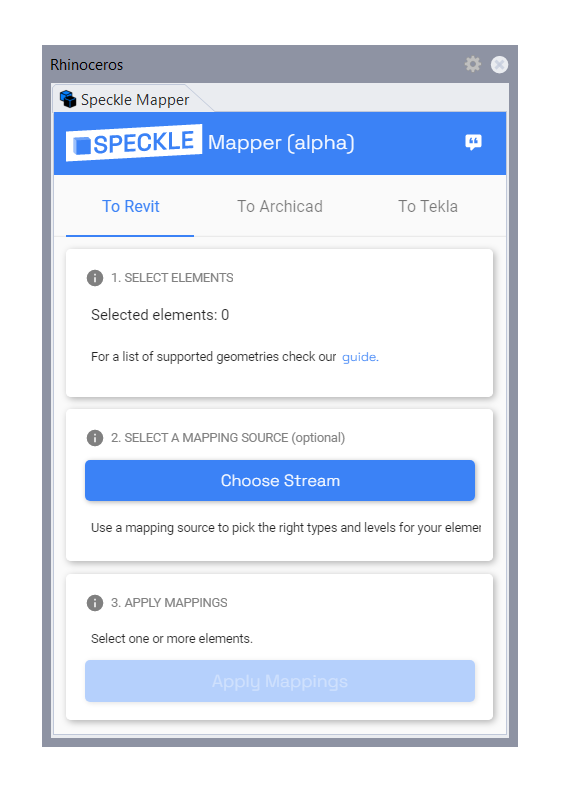

# Rhino

## Quick Start Video

Prefer watching to reading? Who doesn't!

<iframe width="100%" height="100%" style="position: absolute;" src="https://www.youtube.com/embed/v56nxXBbtfI" title="YouTube video player" frameborder="0" allow="accelerometer; autoplay; clipboard-write; encrypted-media; gyroscope; picture-in-picture" allowfullscreen></iframe>

## Getting Started

::: tip 💡 TIP

Check out our dedicated tutorial on [how to get started with Rhino](https://speckle.systems/tutorials/getting-started-with-speckle-for-rhino/)!

:::

To install this Connector and add your Speckle account, follow the instructions in the [Speckle Manager](/user/manager) section.
Speckle currently supports both Rhino 6 and Rhino 7.

Once installed, you can find the connector by running the `Speckle` command in Rhino. This should open a new pop-up window with the [Desktop UI](/user/ui.md) (the old version of Speckle used the `SpecklePanel` command for this).

## User Interface

> This connector uses our shared Desktop UI. Read up on general guidelines for usage in the [Desktop UI section](/user/ui).

Once the Desktop UI panel is open, go ahead and create a new stream (or add an existing one) to the current file. Once the Rhino `.3dm` file is saved, the streams associated with that file will be saved too.

### Sending

Sending objects to Speckle can be done in multiple ways.

- Default method sends `Everything` from Rhino. This includes all document objects and project info.
  
- `Layers` option will send objects on the selected layers.
  
- `Project Information` adds the selected project information as views to the stream.
  
- `Selection` sends only the selected objects.
  

For the detail-lovers out there, you'll notice that your Rhino layer structure is replicated as `Base` object properties, which can be recreated on the receiving end.

### Receiving

In order to receive data from a Speckle stream, you'll first need to add that to your active document. If the stream already exists on the server it will automatically be listed. You can also use the search bar to find the stream you are looking for👀.

Once the stream has been added, switch to the `Receive` mode.

From here, you can select the `branch` and the `commit` you want to receive. Once you are done with the selection, go ahead and click on the `🔵 Receive` button. This will display a progress bar (just like the sending operation) and, if successful, will add the received objects to the current document.

In order to prevent overriding existing layers/objects in the file, all received objects will be placed in a nested layer structure. This structure will contain all the layers. that the sent objects were placed to, with a parent layer with a name in the format `<STREAM_NAME>: <BRANCH_NAME> @ <COMMIT>`.

In the screenshot above, you can see the difference between:

1. The original layers of the sent objects
2. The layers created by Speckle when receiving the data back

You may also notice the overlapping received objects(gray) with the original objects (blue and red).

## Supported Elements

- [Rhino Support Tables](/user/support-tables.html#rhino)

# Rhino Mapper

Speckle 2.0 lets you tag Rhino geometry as Speckle BIM elements, so you can send objects like lines and surfaces as beams and floors! This means you can bring in your Rhino geometry directly as native Revit family elements 💥

## Getting Started

Open the Rhino Mapper panel by clicking on the Speckle Mapper button on the Speckle toolbar, or by using the `SpeckleMappings` command. 

:::tip NOTE

If this is your first time installing the Speckle connector, you may need to load the toolbar by navigating to Options > Toolbars > SpeckleConnectorRhino, and then making sure the Speckle2 checkbox is selected.

:::

## Features

Assigning or removing Speckle BIM tags from geometry objects is easy:

1. Select the geometry you would like to map to a BIM element
2. (Optional) Click `Choose Stream` to select the branch of the Speckle stream that contains your Revit families and levels. If none is selected, a default mapping will be used if available.
3. Click `Apply Mappings`

Rhino Mapper manages BIM mappings by assigning geometry objects a `Attribute User Text` property if they have been flagged as BIM elements while sending to a stream. You can see which objects in your model have been mapped at the bottom of the Speckle Mapper UI.

To remove a mapping, click the checkbox next to the existing mapping and then click `Clear Mappings`.

:::tip NOTE

If no mapping options appear when you select a geometry object, that means there are currently no supported mappings for that object! If you think there should be, give us feedback using the feedback button on the top right corner.

:::

### Creating walls

Walls can be mapped with three different options, depending on the type of surface geometry you've selected:

- For _vertically planar_ single surfaces, you can map a wall by its profile curve or by its base curve.

- For _nonplanar_ single surfaces, you can map a wall as a `FaceWall`.

- The default wall option will generate a wall schema by the surface's base curve.

### Creating Floors

Floors can be mapped to _xy planar surfaces_. Any interior trims in these surfaces will be mapped as voids in the floor.

### Creating Columns

Columns can be mapped to any _linear curve_.

### Creating Beams

Beams can be mapped to any _curve_.

### Creating Pipes

Pipes can be mapped to any _linear curve_.

### Creating Ducts

Ducts can be mapped to any _linear curve_.

### Creating Topography

Topography can be mapped to _open meshes_.

### Creating Direct Shapes

Direct Shapes can be mapped to _breps_ and _meshes_.

### Creating Freeform Elements

Freeform elements can be mapped to _breps_ and _meshes_.

### Creating Family Instances

Family instances can be mapped to _block instances_, using their insertion point and transform for the received revit family instance.

## Things to keep in mind

This section is work in progress 🚧 ! Please check back again soon 😃
